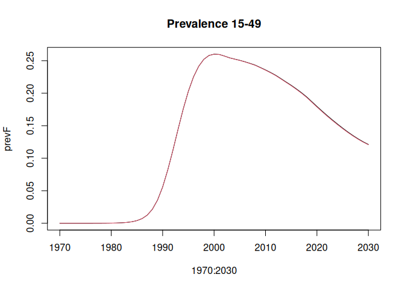
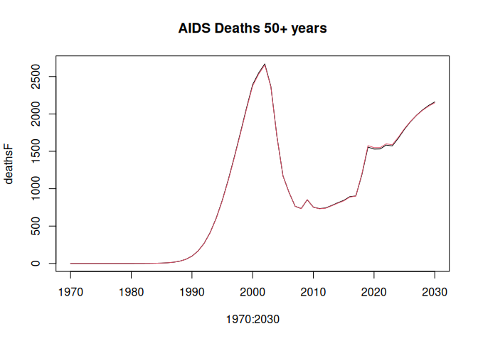

<!-- README.md is generated from README.Rmd. Please edit that file -->

# leapfrog R package

## Installation

Please install from our
[r-universe](https://hivtools.r-universe.dev/builds):

``` r
install.packages(
  "leapfrog",
  repos = c("https://hivtools.r-universe.dev", "https://cloud.r-project.org"))
```

You can install the latest release from [GitHub](https://github.com/)
with:

``` r
# install.packages("remotes")
remotes::install_github("hivtools/leapfrog", subdir = "leapfrogr", ref = "r-release")
```

To install a development version on a branch checkout the repo to the
appropriate branch and take the following steps:

1.  (One time only) setup the `LEAPFROG_INCLUDE` env var using

        ./scripts/setup_dev_env.R

2.  Generate the C++

        ../scripts/generate

3.  Install the package

        Rscript -e  "devtools::install()"

## Simulation model

The “leapfrog” R package is an R interface around the “leapfrog”
simulation model. The model is written in C++ and has interfaces in R,
Python and C. Note the R package is in a subdirectory `leapfrogr` but
the installed package is called `leapfrog`.

The simulation model is implemented in a header-only C++ library located
in [`leapfrog-core/include/`](leapfrog-core/include/). The headers are
bundled into `inst/include` in the installed package which allows the
C++ code to be imported in other R packages via specifying
`LinkingTo: leapfrog` in the `DESCRIPTION` file.

> [!IMPORTANT]
> We use C++20 for this package. Please make sure you have a compiler that is compatible.

The simulation model is callable in R via a wrapper function
`run_model()` created with [Rcpp](https://www.rcpp.org).

You can control how the simulation model is run by setting the
`configuration` argument, see

``` r
leapfrog::list_model_configurations()
```

for the list of available models. At the time of writing these are

- `DemographicProjection` - runs on the demographic projections
- `HivFullAgeStratification` - runs the demographic projection and HIV
  adult projection with single-year age groups
- `HivCoarseAgeStratification` - runs the demographic projection and HIV
  adult projection with 5-year age groups
- `ChildModel` - runs the demographic projection, single-year age
  stratified HIV adult projection and HIV child projection

## Example

The file
`inst/pjnz/bwa_aim-adult-art-no-special-elig_v6.13_2022-04-18.PJNZ`
contains an example Spectrum file constructed from default country data
for Botswana with Spectrum (April 2022).

Prepare model inputs.

``` r
library(leapfrog)

pjnz <- system.file("pjnz/bwa_aim-adult-art-no-special-elig_v6.13_2022-04-18.PJNZ",
                    package = "leapfrog", mustWork = TRUE)

parameters <- process_pjnz(pjnz)
#> Warning in get_data_from_cfg(name, metadata[[name]], dim_vars, dp): Tag not
#> found in DP for adult_non_aids_excess_mort, returning NULL
#> Warning in get_data_from_cfg(name, metadata[[name]], dim_vars, dp): Tag not
#> found in DP for incidence_input, returning NULL
#> Warning in get_data_from_cfg(name, metadata[[name]], dim_vars, dp): Tag not
#> found in DP for adult_art_adj_factor, returning NULL
#> Warning in get_data_from_cfg(name, metadata[[name]], dim_vars, dp): Tag not
#> found in DP for adult_art_adj_factor_flag, returning NULL
#> Warning in get_data_from_cfg(name, metadata[[name]], dim_vars, dp): Tag not
#> found in DP for adult_pats_alloc_to_from_other_region, returning NULL
#> Warning in get_data_from_cfg(name, metadata[[name]], dim_vars, dp): Tag not
#> found in DP for nosocomial_infections, returning NULL
```

Simulate adult ‘full’ age group (single-year age) model from 1970 to
2030 with 10 HIV time steps per year.

``` r
lsimF <- run_model(parameters, "HivFullAgeStratification", 1970:2030)
```

You can also simulate a model with ‘coarse’ age group (5-year age
groups). You need to first prepare the coarse age group parameters

``` r
params_coarse <- process_pjnz(pjnz, use_coarse_age_groups = TRUE)
#> Warning in get_data_from_cfg(name, metadata[[name]], dim_vars, dp): Tag not
#> found in DP for adult_non_aids_excess_mort, returning NULL
#> Warning in get_data_from_cfg(name, metadata[[name]], dim_vars, dp): Tag not
#> found in DP for incidence_input, returning NULL
#> Warning in get_data_from_cfg(name, metadata[[name]], dim_vars, dp): Tag not
#> found in DP for adult_art_adj_factor, returning NULL
#> Warning in get_data_from_cfg(name, metadata[[name]], dim_vars, dp): Tag not
#> found in DP for adult_art_adj_factor_flag, returning NULL
#> Warning in get_data_from_cfg(name, metadata[[name]], dim_vars, dp): Tag not
#> found in DP for adult_pats_alloc_to_from_other_region, returning NULL
#> Warning in get_data_from_cfg(name, metadata[[name]], dim_vars, dp): Tag not
#> found in DP for nosocomial_infections, returning NULL
lsimC <- run_model(params_coarse, "HivCoarseAgeStratification", 1970:2030)
```

Compare the HIV prevalence age 15-49 years and AIDS deaths 50+ years.
Deaths 50+ years are to show some noticeable divergence between the
`"full"` and `"coarse"` age group simulations.

``` r
prevF <- colSums(lsimF$p_hivpop[16:50,,],,2) / colSums(lsimF$p_totpop[16:50,,],,2)
prevC <- colSums(lsimC$p_hivpop[16:50,,],,2) / colSums(lsimC$p_totpop[16:50,,],,2)

deathsF <- colSums(lsimF$p_hiv_deaths[51:81,,],,2)
deathsC <- colSums(lsimC$p_hiv_deaths[51:81,,],,2)

plot(1970:2030, prevF, type = "l", main = "Prevalence 15-49")
lines(1970:2030, prevC, col = 2)
```



``` r

plot(1970:2030, deathsF, type = "l", main = "AIDS Deaths 50+ years")
lines(1970:2030, deathsC, col = 2)
```



## Benchmarking

Install the package and then run the benchmarking script
`../scripts/benchmark`

## lint

Lint R code with `lintr`

``` r
lintr::lint_package()
```

Lint C++ code with [cpplint](https://github.com/cpplint/cpplint)

``` console
cpplint leapfrog-core/include/*
```

## Code design

### R functions

The file `src/leapfrog.cpp` contains R wrapper functions for the model
simulation via [Rcpp](http://dirk.eddelbuettel.com/code/rcpp.html).

## Development notes

### Package loading

The C++ header library lives in `leapfrog-core/include/` (outside the R
package), with generated headers produced by a codegen step. How this is
handled depends on how you are building/installing the package:

| Method | `configure` runs in | Headers used | Manual steps | Notes |
|----|----|----|----|----|
| `devtools::load_all()` | `leapfrogr/` (source) | `LEAPFROG_INCLUDE` or relative path to `../leapfrog-core/include` | Run codegen `../scripts/generate` manually on first run or when schemas change. | When headers in `leapfrog-core/include/` change, C++ recompiles automatically via `Config/build/extra-sources`. |
| `devtools::install()` (default) | Temp dir (tarball) | `LEAPFROG_INCLUDE` env var | `LEAPFROG_INCLUDE` must be set and run codegen manually | `configure` runs from temp dir so `../leapfrog-core` is absent. |
| `R CMD INSTALL leapfrogr/` | `leapfrogr/` (source) | `../leapfrog-core/include` | Nothing (in monorepo) | Will need `LEAPFROG_INCLUDE` env var if using R CMD build |
| `remotes::install_github(..., ref = "r-release")` | Temp dir (subdir only) | `inst/include` (bundled) | Nothing | Self-contained. `r-release` branch has headers bundled. Other branches will fail — use `build=FALSE` from a clone instead. |
| R-universe | Build server | `inst/include` (bundled) | Nothing | Preferred for end users. `r-release` branch is used per `packages.json`. Updated on every merge to `main`. |

To set up `LEAPFROG_INCLUDE` for local development, run the helper
script once:

    ./scripts/setup_dev_env.R

Note that `LEAPFROG_INCLUDE` is not needed for
`remotes::install_github(..., ref = "r-release")` or r-universe installs
— those use the `r-release` branch which has the C++ headers bundled
into `inst/include/`. The `r-release` branch is updated automatically on
every merge to `main`.

For CRAN submission (when we add it), build the tarball from the
`r-release` branch — the headers are already present so it will pass
`R CMD check`.

### Testing

There is some pre-prepared test data available to make tests run faster.
This is generated and saved by `../scripts/create_test_data.R` as
[`hdf5`](https://en.wikipedia.org/wiki/Hierarchical_Data_Format) format
files.

This data is used in `leapfrog-py` for pythont tests and `cpp_interface`
for testing standalone C++ model.

## License

MIT © Imperial College of Science, Technology and Medicine
